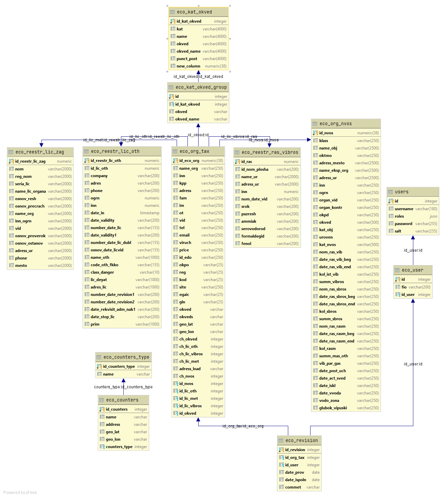

# Эко империум

# BACKEND

## Реализованная функциональность

Выбор данных из БД и выдача для отображения в интерфейсе

## Основной стек технологий

Postgresql 12
Symfony
PHP 7.4 + Composer

## Демо

Демо сервиса доступно по адресу: https://ecoimperium.robotrek24.ru/
Реквизиты тестового пользователя: логин: 'demo', пароль: 'test'

## Среда запуска

Требуется установленный web-сервер с поддержкой PHP(версия 7.4+) интерпретации (apache, nginx);
Требуется установленная СУБД Postgresql (версия 12+);

## Установка

#### База данных

Необходимо создать пустую базу данных и развернуть дамп базы данных из папки db
Подключение к базе данных настроить в файле .env

#### Установка зависимостей проекта

Установка зависимостей осуществляется с помощью Composer. Если у вас его нет вы можете установить его по инструкции на getcomposer.org.
После этого выполнить команду в директории проекта:
composer install

## Схема базы данных



# FRONTEND

Версия nodeJS - v14.17.3

## Установка пакетов
```
yarn install
```

### Сборка и запуск дев сервера
```
yarn serve
```

### Сборка и минификация для прода
```
yarn build
```


### Запуск из docker hub
```
//загрузка image из docker hub
docker pull angrycastor/eco_imperium:latest
//запуск контейнера на 80 порту
docker run -d -p 80:80 angrycastor/eco_imperium:latest
```

